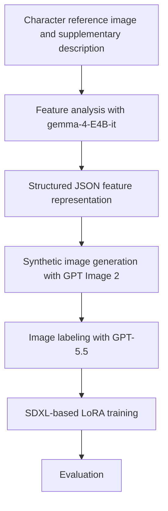
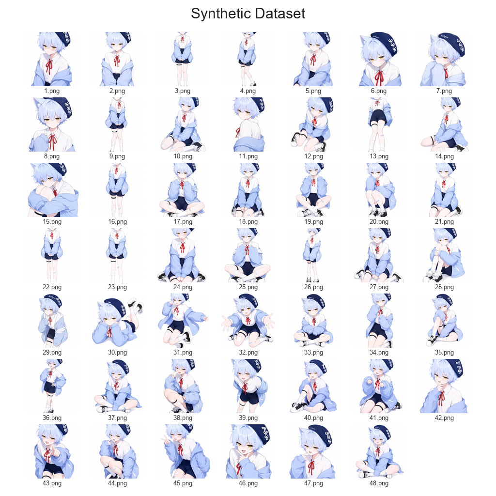
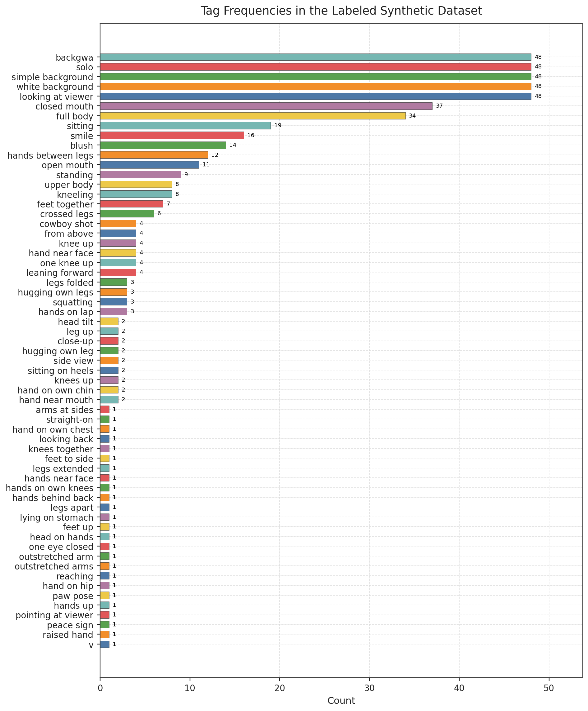
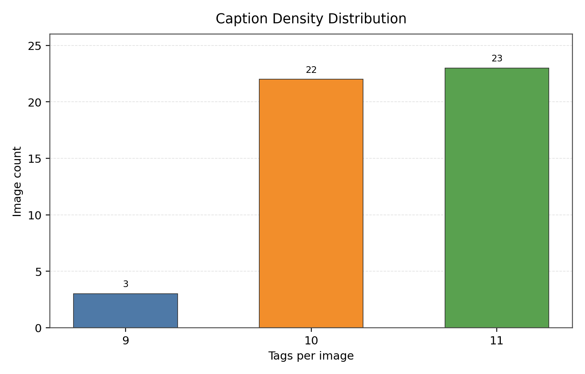
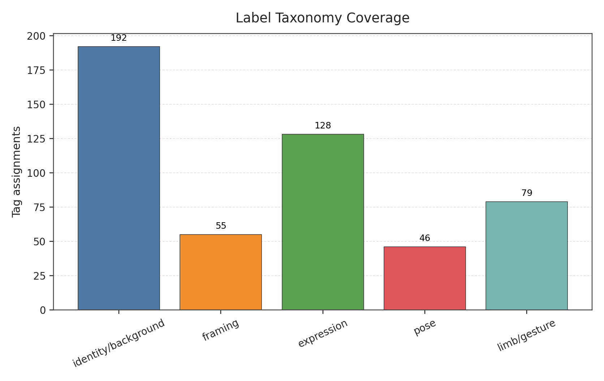
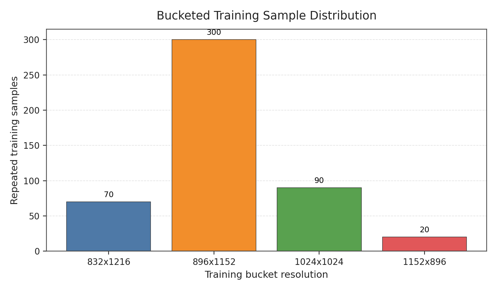

# Character-LoRA

Research on training character LoRA using prompt-guided synthetic image datasets without original training images.

## Abstract

This research examines whether a character LoRA model can be trained without including artist-created works in the training dataset. The proposed approach instead constructs a synthetic image dataset using structured text prompts and generative AI.

The `BACKGWA` character was used as the case study. The publicly released LoRA model is available at [`BackGwa/Character-LoRA`](https://huggingface.co/BackGwa/Character-LoRA) on Hugging Face. The LoRA was trained on the SDXL-based [`BackGwa/LUMIERE-Q`](https://huggingface.co/BackGwa/LUMIERE-Q) model.

The objective of this research is to examine a procedure for constructing character LoRA models while considering training rights, artistic style, and intellectual property. To this end, the research defines an experimental workflow consisting of image analysis, prompt structuring, synthetic image generation, image labeling, and LoRA training, without directly using materials created by the original artist.

## Introduction

Character LoRA is widely used to reproduce the appearance, clothing, and visual features of a specific character in text-to-image models. However, conventional training workflows often include artist-created works, such as original images, fan art, or commercial illustrations, in the dataset. This practice may raise issues related to copyright, the consent of the original creator, unauthorized learning of artistic style, and the rights associated with derivative works.

To mitigate these issues, this research investigates an alternative workflow that does not directly train on materials created by the original artist. The central assumption is that a character's visual features can be converted into structured textual information and that LoRA training can be performed using only synthetic data generated from that information.

### Objectives

The objectives of this research are as follows.

1. To design a character LoRA construction workflow that does not directly use the artist's original images.
2. To examine whether key visual features can be reflected in synthetic images using only structured text prompts.
3. To evaluate the reproducibility and limitations of training an SDXL-based LoRA using only a synthetic dataset.
4. To propose an experimental approach for mitigating copyright and training-data usage concerns.

## Background

LoRA is a training method that efficiently adapts an image generation model to a new concept by adding low-rank adaptation matrices to selected layers, rather than retraining the full set of model weights. This approach preserves most of the base model while enabling the model to learn visual concepts such as a specific character, style, or object with a relatively small amount of data.

Character LoRA training typically uses multiple training images and corresponding captions to incorporate recurring visual elements into the model. Through this process, the model learns to associate repeated features, such as hair color, eye color, clothing, accessories, and silhouette, with a specific trigger prompt.

However, because images are directly used as training data, this method may give rise to copyright and rights-related concerns. When human-created works such as original images, fan art, or commercial illustrations are included in the dataset, the consent of the original creator, unauthorized learning of artistic style, and the legal status of derivative works become central issues.

Synthetic datasets are training datasets constructed through generative AI without directly collecting existing creative works. This research uses such synthetic data for character LoRA training and examines whether the main features of a character can be reproduced while reducing dependence on original images.

## Methodology

The overall workflow of this research consists of the following stages.



### 1. Feature Analysis

To construct prompts for describing the character, the character image and a predefined system prompt were provided to the locally executed `gemma-4-E4B-it` model. The purpose of this stage was to structure the character's main visual elements as text.

The analysis used the instructions in [`prompts/INSTRUCTION.md`](prompts/INSTRUCTION.md) and the JSON structure defined in [`prompts/schema.json`](prompts/schema.json).

The output was required to be structured JSON containing a top-level `description` and an `object` list. The `description` field provides summary information to be considered when generating images, such as the character's overall appearance, pose, and visual impression.

The `object` field is a list of individual visual elements that constitute the character. Each item includes `name`, `description`, and `position`, and specifies what the element is, how it appears, and how it is arranged in relation to the character.

Because image input alone may not allow the model to distinguish persistent character traits from image-specific expressions, supplementary information was provided together with the image. This included the character name, features that must be preserved, and details requiring interpretation, so that the resulting JSON could be used directly in the subsequent image generation stage.

### 2. Synthetic Dataset Construction

The synthetic image dataset was generated using GPT Image 2 based on the structured JSON output from the character feature analysis stage. The JSON was provided directly as input to GPT Image 2. Where necessary, supplementary information was also provided alongside the JSON, and additional natural language instructions were included to control image quality and output consistency. No images created by the artist were used as training data in this process.

A total of 80 synthetic images were generated as training candidates. Among them, 48 images were selected for the final dataset. The remaining 32 images were excluded on the grounds that they did not reflect the character's visual consistency, exhibited excessive distortion or insufficient quality, or contained damage or corruption in part of the image.

#### Synthetic Dataset Overview

The following figure presents the 48 synthetic images selected for the final training dataset in a 7x7 grid.



As shown in the figure, the final dataset does not rely on a single composition. Instead, it includes multiple visual configurations, such as upper-body views, full-body views, seated poses, close-up views, and near-side-view compositions. This composition was intended to preserve the character's core visual attributes while reducing excessive bias toward a specific pose or framing pattern in the training data.

### 3. Image Labeling

The generated synthetic images were labeled after generation using GPT-5.5. Labels were formatted using the Danbooru tag convention, with individual tags separated by commas. The tags describe the visible attributes of the character in each image, including aspects such as expression, pose, and composition.

It should be noted that the labels generated by GPT-5.5 were not further filtered or normalized against the official Danbooru tag vocabulary. Therefore, some labels may include tags that are not used in Danbooru or tags that are uncommon in actual Danbooru usage. This study used the generated labels as-is, and no additional tag validation, synonym merging, or vocabulary normalization was performed.  
The following chart shows the frequency of all tags used in the labeled dataset.



#### Dataset Label Density and Taxonomy

For the 48 synthetic images selected for the final training dataset, this research examined both per-image label density and the distribution of label categories. Each label was designed to describe observable visual attributes in the image, including the character identifier, background condition, composition, facial expression, pose, and the position of the hands and legs. This labeling strategy was intended to reflect image-level variation in pose and expression within the training captions, rather than relying only on repeated character-name captions.

|  |  |
| --- | --- |

The two figures summarize the labeling structure of the final synthetic dataset. The left figure shows the distribution of the number of tags per image. Across the 48 images, the mean number of tags was approximately 10.42 and the median was 10. The minimum and maximum numbers of tags were 9 and 11, respectively, indicating that most images maintained a comparable level of caption density.

The right figure presents the distribution of labels grouped by semantic category. Identity and background-related tags were included consistently across the dataset, while additional tags described expression, framing, pose, and limb or gesture information. This distribution indicates that the dataset was constructed to preserve core character-identifying information while also incorporating variation in composition and pose.

### 4. LoRA Training

The LoRA was trained using `sd-scripts` with the SDXL-based `BackGwa/LUMIERE-Q` model. The main training settings are summarized as follows. Parameters not listed in the table followed the default settings of `sd-scripts`.

| Item | Value |
| --- | --- |
| Base Model | `BackGwa/LUMIERE-Q` |
| Dataset size | 48 |
| Resolution | `1024x1024` |
| Repeats | `10` |
| Epochs | `10` |

#### Training Bucket Distribution

LoRA training in this research was performed using the bucket mechanism provided by `sd-scripts`. The synthetic dataset was not composed exclusively of square images; some images had portrait or landscape aspect ratios. Therefore, instead of forcing all images into a single resolution, the training process assigned images to multiple resolution buckets according to their aspect ratios.



The figure shows the training bucket distribution extracted from the metadata of `BACKGWA.safetensors`. After accounting for dataset repeats, the training set consisted of 480 repeated training samples distributed across the `832x1216`, `896x1152`, `1024x1024`, and `1152x896` buckets. The largest number of samples was assigned to the `896x1152` bucket, followed by the `1024x1024` and `832x1216` buckets.

This result suggests that the final training dataset did not rely on a single composition or aspect ratio. Bucket-based training also helps preserve the original framing and image proportions during training, allowing full-body, upper-body, seated, and close-up compositions to be represented more appropriately in the LoRA training process.

### 5. Evaluation

The trained LoRA was evaluated by combining the same trigger prompt with various poses, compositions, and quality tags. The evaluation focused on whether the core character features were preserved, how consistently the model responded to prompt variations, and how noise or distortion originating from the synthetic dataset affected the generated outputs.

## Results

This research confirmed that the main features of a character can be incorporated into a LoRA model using only structured text prompts and an AI-generated synthetic image dataset, without directly using original reference images as training data.

Within the scope of this research, the results suggest that, for characters with relatively simple and clearly defined appearances, the core features could be reproduced consistently through text-based reconstruction and synthetic data generation alone.

However, the results also suggest that characters with more complex designs may show lower reproducibility. This limitation appears to be related to the difficulty of representing all visual relationships through structured prompts alone, as well as the limited ability of the image generation model to maintain complex details consistently.

## Discussion

### Limitations

This research has the following limitations.

1. The quality of the dataset is highly dependent on the output quality of the synthetic image generation model.
2. Some generated images contained shape distortion, visual degradation, or noise.
3. Synthetic images produced with GPT Image 2 may include watermarks, which can reduce dataset quality.
4. As character designs become more complex, it becomes difficult to preserve all visual features using structured text prompts alone.
5. Because this research was conducted on a single character and a limited dataset, additional validation is required before generalizing the workflow to broader character LoRA training scenarios.

### Conclusion

This research demonstrates the feasibility of constructing a character LoRA without directly using original reference images as training data. The proposed workflow, consisting of model-assisted feature analysis, JSON-based prompt structuring, synthetic image generation, and automated labeling, provides an alternative approach to character LoRA construction that reduces reliance on human-created works.

The primary contribution of this research is the definition and experimental validation of this workflow. The results confirm that structured supplementary information provided alongside the reference image contributes to improved output quality during feature analysis, and that consistency specifications in the image generation stage are effective for reducing variation in the synthetic dataset.

Future work should address the reproducibility challenges observed for characters with complex designs, explore methods for mitigating generation artifacts and watermarks in synthetic data, and extend validation to a broader set of characters and base models.

## Scope and Clarifications

This research is not intended to imitate or learn the artistic style of a specific artist. This research examines a procedure for constructing a character LoRA without directly using images created by the original artist as training data. Therefore, the purpose of this research is not to reproduce the artistic style of a specific artist.

The procedure used in this research converts the external visual components of a character into text and structured JSON. A synthetic image dataset is then generated from that information and used for LoRA training. The focus of this process is on recurring character design elements that can be identified across the character representation. The artistic style of a specific artist was not defined as a training objective and no experiment was conducted to evaluate such style reproduction.

The approach proposed in this research does not imply freedom from rights-related or responsibility-related concerns. When a character has an original creator or rights holder, the permissibility of using that character may still require legal and ethical review, even if original images are not directly included in the training dataset.

Accordingly, this research examines an experimental procedure for reducing reliance on the direct use of artist-created images as training data. It does not claim that the right to use a specific character or its generated outputs is automatically obtained through this procedure. The results of this research should be understood as an examination of an alternative method for constructing training data in character LoRA production and do not replace legal judgment regarding infringement or permitted use.

Generated synthetic images and outputs from the trained LoRA may still raise separate responsibility issues depending on their actual use. Therefore, users must independently review relevant standards and ethical considerations when applying the method described in this research to actual production or distribution.

## Ethics Statement

This repository and the accompanying research document are provided to explore methods for mitigating copyright and training-data usage concerns in character LoRA production. This research does not imply permission to use the original rights holder's copyright, trademarks, character rights, or other intellectual property without authorization, nor does it imply any license to use such rights or any waiver of those rights.

Users must ensure that generated images and other derivative outputs do not infringe upon the rights, reputation, or legitimate interests of the original creator, character rights holders, or third parties. Users are also responsible for complying with applicable laws, platform policies, terms of service, and ethical standards. Any legal or social responsibility arising from the use of generated outputs rests with the user.

## License

This research document is released under the MIT License.  
The referenced LoRA model is released under the CreativeML Open RAIL-M license.

## References

- Public example model: [`BackGwa/Character-LoRA`](https://huggingface.co/BackGwa/Character-LoRA)
- Base model: [`BackGwa/LUMIERE-Q`](https://huggingface.co/BackGwa/LUMIERE-Q)
- LoRA: Low-Rank Adaptation of Large Language Models, [`arXiv:2106.09685`](https://arxiv.org/abs/2106.09685)
- SDXL: Improving Latent Diffusion Models for High-Resolution Image Synthesis, [`arXiv:2307.01952`](https://arxiv.org/abs/2307.01952)
- `sd-scripts`: [`kohya-ss/sd-scripts`](https://github.com/kohya-ss/sd-scripts)
- `gemma-4-E4B-it`: locally executed model used for initial prompt reconstruction, [`google/gemma-4-E4B-it`](https://huggingface.co/google/gemma-4-E4B-it)
- GPT Image 2: image generation model used to construct the synthetic image dataset, [`Introducing ChatGPT images 2.0`](https://openai.com/index/introducing-chatgpt-images-2-0/)
- GPT-5.5: model used for synthetic image labeling, [`Introducing GPT-5.5`](https://openai.com/index/introducing-gpt-5-5/)


## Citation

```
@misc{backgwa_2026,
	author       = { BACKGWA },
	title        = { Character-LoRA (Revision 242bcf7) },
	year         = 2026,
	url          = { https://huggingface.co/BackGwa/Character-LoRA },
	doi          = { 10.57967/hf/8830 },
	publisher    = { Hugging Face }
}
```
