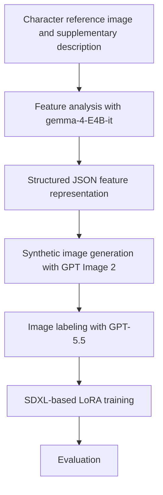
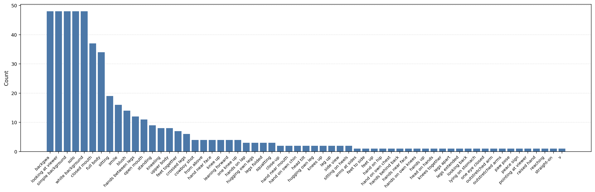

# Character-LoRA

Research on training character LoRA using prompt-guided synthetic image datasets without original training images.

## Abstract

This research examines whether a character LoRA model can be trained without including artist-created works in the training dataset. The proposed approach instead constructs a synthetic image dataset using structured text prompts and generative AI.

The `BACKGWA` character was used as the case study. The publicly released LoRA model is available at [`BackGwa/Character-LoRA`](https://huggingface.co/BackGwa/Character-LoRA) on Hugging Face. The LoRA was trained on the SDXL-based [`BackGwa/LUMIERE-Q`](https://huggingface.co/BackGwa/LUMIERE-Q) model.

The objective of this research is to examine a procedure for constructing character LoRA models while considering training rights, artistic style, and intellectual property. To this end, the research defines an experimental workflow consisting of image analysis, prompt structuring, synthetic image generation, image labeling, and LoRA training, without directly using materials created by the original artist.

## Introduction

Character LoRA is widely used to reproduce the appearance, clothing, and visual features of a specific character in text-to-image models. However, conventional training workflows often include artist-created works, such as original images, fan art, or commercial illustrations, in the dataset. This practice may raise issues related to copyright, the consent of the original creator, unauthorized learning of artistic style, and the rights associated with derivative works.

To mitigate these issues, this research investigates an alternative workflow that does not directly train on materials created by the original artist. The central assumption is that a character's visual features can be converted into structured textual information and that LoRA training can be performed using only synthetic data generated from that information.

### Objectives

The objectives of this research are as follows.

1. To design a character LoRA construction workflow that does not directly use the artist's original images.
2. To examine whether key visual features can be reflected in synthetic images using only structured text prompts.
3. To evaluate the reproducibility and limitations of training an SDXL-based LoRA using only a synthetic dataset.
4. To propose an experimental approach for mitigating copyright and training-data usage concerns.

## Background

LoRA is a training method that efficiently adapts an image generation model to a new concept by adding low-rank adaptation matrices to selected layers, rather than retraining the full set of model weights. This approach preserves most of the base model while enabling the model to learn visual concepts such as a specific character, style, or object with a relatively small amount of data.

Character LoRA training typically uses multiple training images and corresponding captions to incorporate recurring visual elements into the model. Through this process, the model learns to associate repeated features, such as hair color, eye color, clothing, accessories, and silhouette, with a specific trigger prompt.

However, because images are directly used as training data, this method may give rise to copyright and rights-related concerns. When human-created works such as original images, fan art, or commercial illustrations are included in the dataset, the consent of the original creator, unauthorized learning of artistic style, and the legal status of derivative works become central issues.

Synthetic datasets are training datasets constructed through generative AI without directly collecting existing creative works. This research uses such synthetic data for character LoRA training and examines whether the main features of a character can be reproduced while reducing dependence on original images.

## Methodology

The overall workflow of this research consists of the following stages.

### 1. Feature Analysis

To construct prompts for describing the character, the character image and a predefined system prompt were provided to the locally executed `gemma-4-E4B-it` model. The purpose of this stage was to structure the character's main visual elements as text.

The analysis used the instructions in [`prompts/INSTRUCTION.md`](prompts/INSTRUCTION.md) and the JSON structure defined in [`prompts/schema.json`](prompts/schema.json).

The output was required to be structured JSON containing a top-level `description` and an `object` list. The `description` field provides summary information to be considered when generating images, such as the character's overall appearance, pose, and visual impression.

The `object` field is a list of individual visual elements that constitute the character. Each item includes `name`, `description`, and `position`, and specifies what the element is, how it appears, and how it is arranged in relation to the character.

Because image input alone may not allow the model to distinguish persistent character traits from image-specific expressions, supplementary information was provided together with the image. This included the character name, features that must be preserved, and details requiring interpretation, so that the resulting JSON could be used directly in the subsequent image generation stage.

### 2. Synthetic Dataset Construction

The synthetic image dataset was generated using GPT Image 2 based on the structured JSON output from the character feature analysis stage. No images created by the artist were used as training data in this process.

A total of 80 synthetic images were generated as training candidates. Among them, 48 images were selected for the final dataset based on consistency and quality.

### 3. Image Labeling

The generated synthetic images were labeled after generation using GPT-5.5. The labels describe the character's expression, pose, composition, and other visible attributes in each image.  
The following chart shows the frequency of all tags used in the labeled dataset.

### 4. LoRA Training

The LoRA was trained using `sd-scripts` with the SDXL-based `BackGwa/LUMIERE-Q` model. The main training settings are summarized as follows. Parameters not listed in the table followed the default settings of `sd-scripts`.

| Item | Value |
| --- | --- |
| Base Model | `BackGwa/LUMIERE-Q` |
| Dataset size | 48 |
| Resolution | `1024x1024` |
| Repeats | `10` |
| Epochs | `10` |

### 5. Evaluation

The trained LoRA was evaluated by combining the same trigger prompt with various poses, compositions, and quality tags. The evaluation focused on whether the core character features were preserved, how consistently the model responded to prompt variations, and how noise or distortion originating from the synthetic dataset affected the generated outputs.

## Results

This research confirmed that the main features of a character can be incorporated into a LoRA model using only structured text prompts and an AI-generated synthetic image dataset, without directly using original reference images as training data.

Within the scope of this research, the results suggest that, for characters with relatively simple and clearly defined appearances, the core features could be reproduced consistently through text-based reconstruction and synthetic data generation alone.

However, the results also suggest that characters with more complex designs may show lower reproducibility. This limitation appears to be related to the difficulty of representing all visual relationships through structured prompts alone, as well as the limited ability of the image generation model to maintain complex details consistently.

## Discussion

### Limitations

This research has the following limitations.

1. The quality of the dataset is highly dependent on the output quality of the synthetic image generation model.
2. Some generated images contained shape distortion, visual degradation, or noise.
3. Synthetic images produced with GPT Image 2 may include watermarks, which can reduce dataset quality.
4. As character designs become more complex, it becomes difficult to preserve all visual features using structured text prompts alone.
5. Because this research was conducted on a single character and a limited dataset, additional validation is required before generalizing the workflow to broader character LoRA training scenarios.

### Conclusion

This research demonstrates that the main visual features of a character can be reproduced in a LoRA model using only structured text prompts and a synthetic image dataset, without directly using original reference images as training data.

The results indicate that, for characters with relatively simple and clearly defined visual features, major appearance elements can be reproduced consistently through text-based reconstruction. However, reproducibility decreased for characters with complex clothing structures, numerous decorative elements, or irregular forms.

The research also observed that limitations of the synthetic image generation model can lead to shape degradation or noise in some images. In the case of the GPT Image 2-based synthetic data used in this research, image watermarks were also identified as a potential factor reducing dataset quality.

During prompt reconstruction, providing detailed textual information about the character's visual design in addition to the image itself contributed to improving output quality. In the image generation stage, adding specifications for consistent outputs after constructing JSON-based structured prompts was also effective for producing a higher-quality synthetic dataset.

Therefore, this research demonstrates the feasibility of constructing a character LoRA without directly training on original images created by human artists. Nevertheless, the reproducibility of complex characters, the quality of synthetic data, and the bias and output stability of image generation models remain important directions for future work.

## Scope and Clarifications

This research is not intended to imitate or learn the artistic style of a specific artist. This research examines a procedure for constructing a character LoRA without directly using images created by the original artist as training data. Therefore the purpose of this research is not to reproduce the artistic style of a specific artist.

The procedure used in this research converts the external visual components of a character into text and structured JSON. A synthetic image dataset is then generated from that information and used for LoRA training. The focus of this process is on recurring character design elements that can be identified across the character representation. The artistic style of a specific artist was not defined as a training objective and no experiment was conducted to evaluate such style reproduction.

The approach proposed in this research does not imply freedom from rights-related or responsibility-related concerns. When a character has an original creator or rights holder the permissibility of using that character may still require legal and ethical review even if original images are not directly included in the training dataset.

Accordingly this research examines an experimental procedure for reducing reliance on the direct use of artist-created images as training data. It does not claim that the right to use a specific character or its generated outputs is automatically obtained through this procedure. The results of this research should be understood as an examination of an alternative method for constructing training data in character LoRA production and do not replace legal judgment regarding infringement or permitted use.

Generated synthetic images and outputs from the trained LoRA may still raise separate responsibility issues depending on their actual use. Therefore users must independently review relevant standards and ethical considerations when applying the method described in this research to actual production or distribution.

## Ethics Statement

This repository and the accompanying research document are provided to explore methods for mitigating copyright and training-data usage concerns in character LoRA production. This research does not imply permission to use the original rights holder's copyright, trademarks, character rights, or other intellectual property without authorization, nor does it imply any license to use such rights or any waiver of those rights.

Users must ensure that generated images and other derivative outputs do not infringe upon the rights, reputation, or legitimate interests of the original creator, character rights holders, or third parties. Users are also responsible for complying with applicable laws, platform policies, terms of service, and ethical standards. Any legal or social responsibility arising from the use of generated outputs rests with the user.

## License

This research document is released under the MIT License.  
The referenced LoRA model is released under the CreativeML Open RAIL-M license.

## References

- Public example model: [`BackGwa/Character-LoRA`](https://huggingface.co/BackGwa/Character-LoRA)
- Base model: [`BackGwa/LUMIERE-Q`](https://huggingface.co/BackGwa/LUMIERE-Q)
- SDXL: Improving Latent Diffusion Models for High-Resolution Image Synthesis, [`arXiv:2307.01952`](https://arxiv.org/abs/2307.01952)
- `sd-scripts`: [`kohya-ss/sd-scripts`](https://github.com/kohya-ss/sd-scripts)
- `gemma-4-E4B-it`: locally executed model used for initial prompt reconstruction
- GPT Image 2: image generation model used to construct the synthetic image dataset
- GPT-5.5: model used for synthetic image labeling
